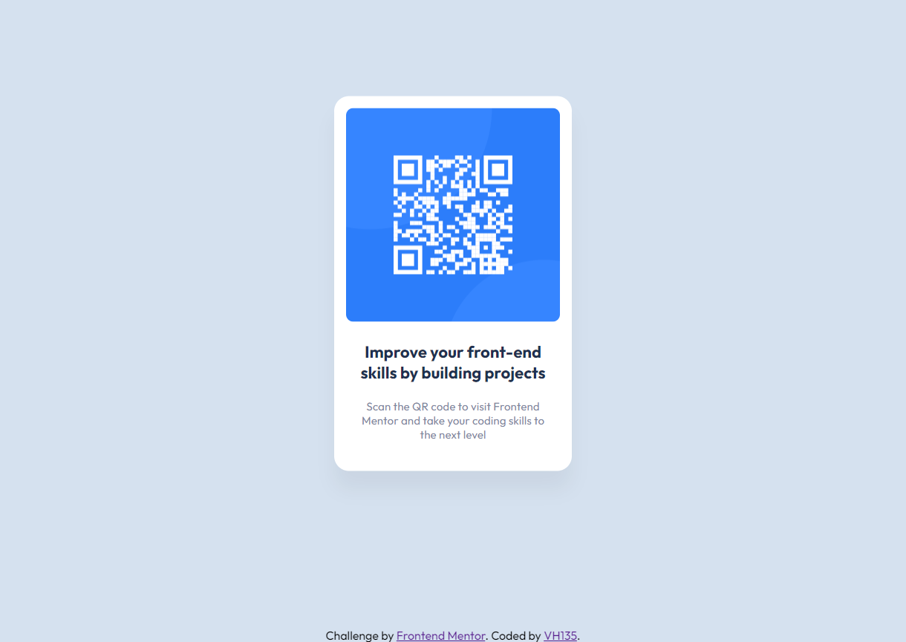

# Frontend Mentor - QR code component solution

This is a solution to the [QR code component challenge on Frontend Mentor](https://www.frontendmentor.io/challenges/qr-code-component-iux_sIO_H). Frontend Mentor challenges help you improve your coding skills by building realistic projects. 

## Table of contents

- [Overview](#overview)
  - [Screenshot](#screenshot)
  - [Links](#links)
- [My process](#my-process)
  - [Built with](#built-with)
  - [What I learned](#what-i-learned)
  - [Continued development](#continued-development)
  - [Useful resources](#useful-resources)
- [Author](#author)

## Overview

### Screenshot



### Links

- Solution URL: [GitHub](https://github.com/VH135/qr-code-component)
- Live Site URL: [GitHub Pages](https://vh135.github.io/qr-code-component/)

## My process

### Built with

- Semantic HTML5 markup
- CSS custom properties
- Pixel Perfect

### What I learned

Well, it's imortant to practice as much as possible, if we don't use our skills and knowledge we may forget them very quickly.
I spent some time googling about how to center element using `margin: auto;` and how to fix footer at the bottom of the page just to refresh my memory. Realised it with fixed position:
```
.attribution {
    position: fixed;
    left: 0;
    bottom: 0;
    width: 100%;
    text-align: center;
}
```

### Continued development

In my future projects I want to continue using SCSS and make work with colors more convenient by using CSS Variables.

### Useful resources

- [freeCodeCamp: How to center anyhing](https://www.freecodecamp.org/news/how-to-center-anything-with-css-align-a-div-text-and-more/) - This helped me with centering. I really liked this patterns and examples.
- [W3Schools: How to create a fixed footer](https://www.w3schools.com/howto/howto_css_fixed_footer.asp) - This is great example of fixed footer. I'd recommend it to anyone still learning this concept.

## Author

- GitHub - [VH135](https://github.com/VH135)
- Frontend Mentor - [@VH135](https://www.frontendmentor.io/profile/VH135)